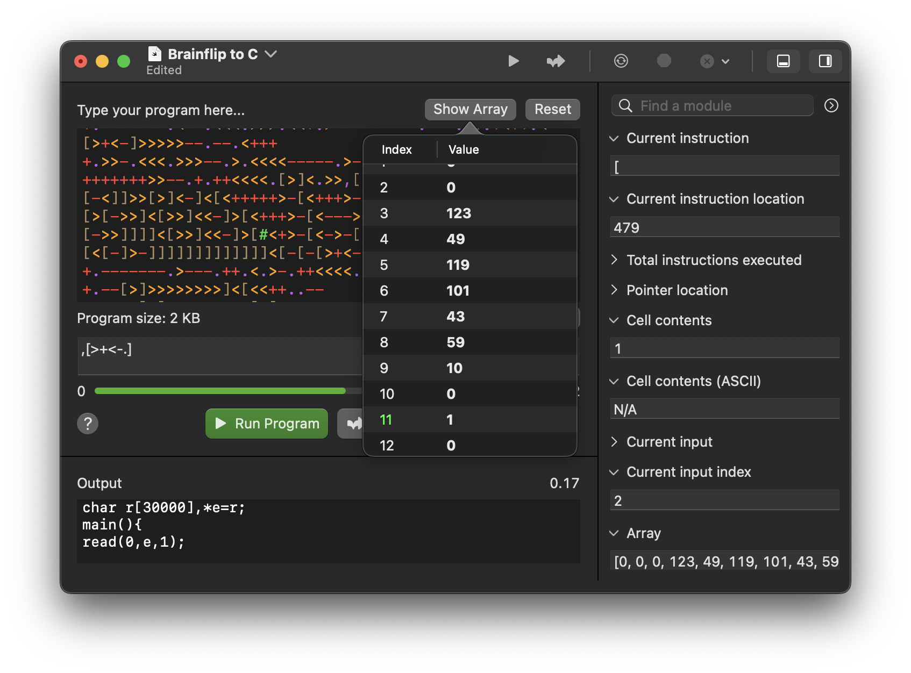
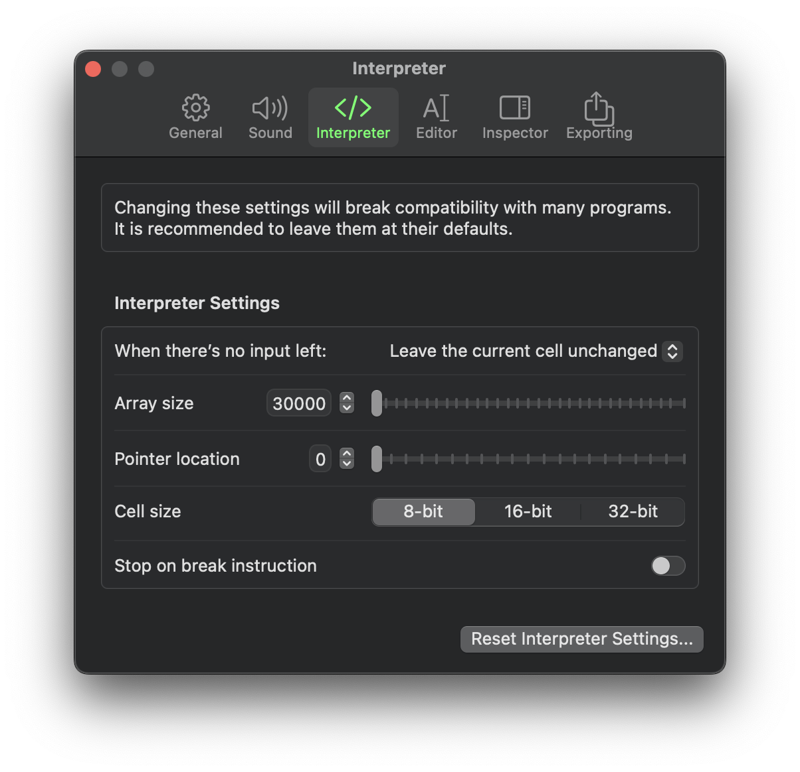

# Brainflip
a human-usable brainf\*\*k interpreter for macOS

## Overview

*Quick disclaimer: This readme doubles as a testing ground for Markdown formatting. So expect to see a lot of mostly pointless shenanigans.*

--------------------------------------------------------------------

We've all heard of brainf\*\*k -- you know, that "*programming language*" where the standard "Hello, World!" program looks like this:

```brainfuck
>++++++++[<+++++++++>-]<.>++++[<+++++++>-]<+.+++++++..+++.>>++++++[<+++++++>-]<+
+.------------.>++++++[<+++++++++>-]<+.<.+++.------.--------.>>>++++[<++++++++>-
]<+.
```

Not very enticing, is it?

Brainflip attempts (*attempts*) to remedy that.



You're provided with a relatively full-fledged editor to do your ~~evildoings~~ programming with. You can run programs, trim those programs to make them *really* unreadable, step through programs to identify that *one stupid instruction* that's breaking ***literally everything***, and inspect just about every aspect of the interpreter, from the total instructions executed to the exact contents of the array.

Oh, and did I mention it's highly configurable? It's highly configurable. Like, *really* highly configurable. Like, *so* ridiculously configurable it's excessive.



## Configurable Settings

### Interpreter
- [x] Changing the behavior on end-of-input
- [x] Customizing the array size
- [x] Altering the intiial pointer location
- [x] Choosing between 8-bit, 16-bit, or 32-bit cells
- [x] Break instructions (#)

### Editor
- [x] Syntax highlighting (slow with files over 300B or so)
- [x] Custom font size
- [x] Highlighting the current instruction
- [x] Viewing the program size for the same reason as the timer

### Inspector
- [x] Customizing modules, namely:
  - [x] Current instruction
  - [x] Current instruction location
  - [x] Total instructions executed
  - [x] Pointer location
  - [x] Cell contents
  - [x] Cell contents (ASCII)
  - [x] Current input
  - [x] Current input index
  - [x] Array
  - [x] Pointer movement instructions
  - [x] Cell manipulation instructions
  - [x] Control flow instructions
  - [x] I/O instructions
  - [x] Break instructions
  
### Exporting
- [x] Exporting BF programs to C source, with support for customizing:
  - [x] Indentation
  - [x] The pointer name
  - [x] The array name
  - [x] The positions of `++` and `--`
  - [x] Whether to include `!= 0` in `while` statements
  - [x] New lines before `{`
  - [x] Including `void` within the declaration for `main()`
  - [x] Extreme whitespace customization

### Other
- [x] A timer, so you know exactly how inefficient a programmer you are
- [x] Sending notifications when something happens
- [x] Sound effects when something happens

## Other Features
- [x] An App Shortcut, so you can ~~inflict your pain~~ run BF programs *anywhere*!
- [x] Semi-comprehensive help
- [x] An extended ASCII chart (extended 'cause it's actually Unicode)
- [x] Copy and paste buttons

## Contextual Junk

This is basically my pet project. I've been working on it since 10:09 AM on February 23, 2023, if APFS folder creation dates are to be trusted.

## References

I used the [epistle to the implementors] as a reference when putting together the interpreter and some of its settings. I don't know who the heck you are, but thanks anyway, Daniel.

[epistle to the implementors]: http://brainfuck.org/epistle.html "Hey Siri, define \"epistle\""
