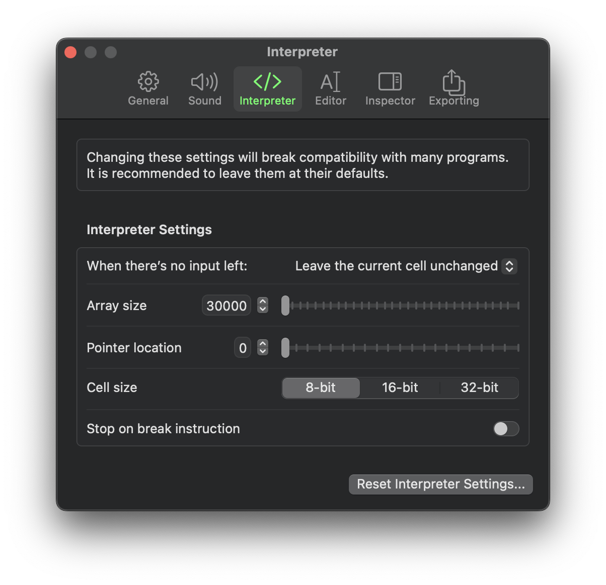

# Brainflip
a human-usable brainf\*\*k interpreter

## To Do

- [x] Implement an App Shortcut
- [ ] Enable the array popover to be detatched
- [ ] Clean up `ProgramState` (*god*, that thing's a mess)

## Overview

*Quick disclaimer: This readme doubles as a testing ground for Markdown formatting. So expect to see a lot of mostly pointless shenanigans.*

--------------------------------------------------------------------

We've all heard of brainf\*\*k -- you know, that "*programming language*" where the standard "Hello, World!" program looks like this:

```brainfuck
>++++++++[<+++++++++>-]<.>++++[<+++++++>-]<+.+++++++..+++.>>++++++[<+++++++>-]<+
+.------------.>++++++[<+++++++++>-]<+.<.+++.------.--------.>>>++++[<++++++++>-
]<+.
```

Not very enticing, is it?

Brainflip attempts (*attempts*) to remedy that. You're provided with a relatively full-fledged editor to do your ~~evildoings~~ programming with. You can run programs, trim those programs to make them *really* unreadable, step through programs to identify that *one stupid instruction* that's breaking ***literally everything***, and inspect just about every aspect of the interpreter, from the total instructions executed to the exact contents of the array.

Oh, and did I mention it's highly configurable? It's highly configurable. Like, *really* highly configurable. Like, *so* ridiculously configurable it's excessive.



## Features
- [x] Timer, so you know exactly how inefficient a programmer you are

## Contextual Junk

This is basically my pet project. I've been working on it since 10:09 AM on February 23, 2023, if APFS folder creation dates are to be trusted.

## References

I used the [epistle to the implementors] as a reference when putting together the interpreter and some of its settings. I don't know who the heck you are, but thanks anyway, Daniel.

[epistle to the implementors]: http://brainfuck.org/epistle.html "Hey Siri, define \"epistle\""
